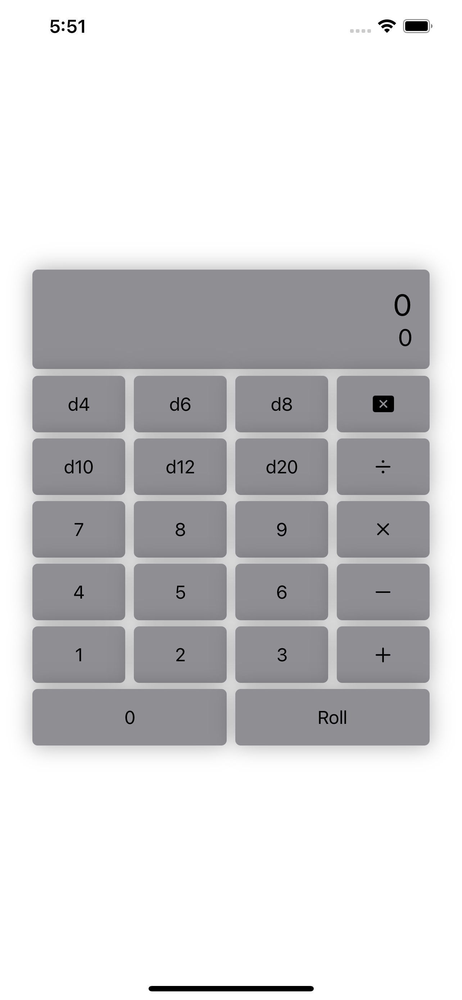
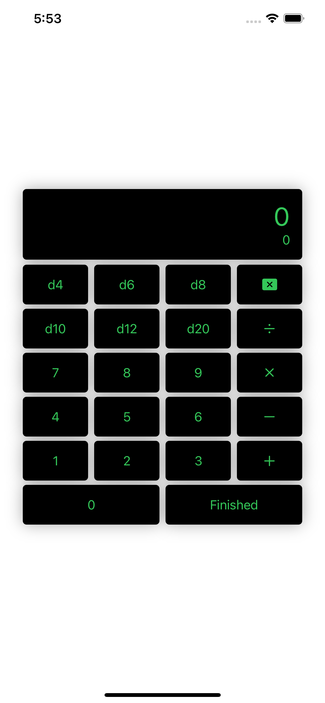

# RPGDiceCalculator
> A Swift Package for creating and rolling dice formulae. 

[![Swift Version][swift-image]][swift-url]
[![Build Status][travis-image]][travis-url]
[![License][license-image]][license-url]
[![codebeat-badge][codebeat-image]][codebeat-url]

With RPGDiceCalculator you can create both simple and complex dice-based formulae within your application and roll those

<!--  -->

## Installation

Add this project on your `Package.swift`

```swift
import PackageDescription

let package = Package(
    dependencies: [
        .Package(url: "https://github.com/Michaelcraun/DiceCalc.git", majorVersion: 0, minor: 0)
    ]
)
```

Alternatively, you can add this package to your Xcode project directly by clicking `File > Swift Packages > Add Package Dependency...` and pasting the link to this repository (`https://github.com/Michaelcraun/DiceCalc.git`) in the dialog box.

## Usage example

You can use the default layout simply by using the default initializer like so:

```swift
import RPGDiceCalculator
import SwiftUI

struct SomeView: View {
    var body: some View {
        DiceCalculatorView()
    }
}
```



Or you can customize the calculator's appearance using an instance of the DiceCalculatorConfiguration, like so:

```swift
import RPGDiceCalculator
import SwiftUI

struct DicePickerView: View {
    var configuration: DiceCalculatorConfiguration {
        DiceCalculatorConfiguration(
            buttonConfiguration: ButtonConfiguration(
                foregroundColor: (normal: .primary, pressed: Color.secondary),
                backgroundColor: (normal: .secondary, pressed: .secondary)),
            formulaFont: .body,
            outputFont: .largeTitle,
            rollButtonTitle: "Finished")
    }
    
    var body: some View {
        DiceCalculatorView(configuration: configuration)
    }
}
```
There are many more customization options built in to the calculator, so play around with them until you're happy with it's appearance! :)



### Using the data

RPGDiceCalculator has two completion handlers for your use: `onChange` and `onRoll`. Each of these sends different data back to the receiver and can be implemented with the `.onChange(_:)` and `.onRoll(_:)` functions of the data model, like so:
```swift
import RPGDiceCalculator
import SwiftUI

struct DicePickerView: View {
    var configuration: DiceCalculatorConfiguration {
        DiceCalculatorConfiguration(
            buttonConfiguration: ButtonConfiguration(
                foregroundColor: (normal: .primary, pressed: Color.secondary),
                backgroundColor: (normal: .secondary, pressed: .secondary)),
            formulaFont: .body,
            outputFont: .largeTitle,
            rollButtonTitle: "Finished")
    }
    
    var viewModel: DiceCalculatorViewModel {
        DiceCalculatorViewModel()
            .onChange { formula in 
                print(formula)
            }
            .onRoll { roll in 
                print(roll)
            }
    }
    
    var body: some View {
        DiceCalculatorView(viewModel, configuration: configuration)
    }
}
```

### Limitations

**Number of Dice.** While testing, I found that a number of dice with 6 or more digits took almost a full second to calculate the rolls, so numbers with more than 5 digits have been disabled within this project. When the user attempts to enter a 6th digit while using the calculator, nothing happens.   

## Further Development/Assitance

If you would like to contribute to this project, please feel free to do so. I believe strongly in open-source collaboration! :)
Before opening your PR, please create an issue within GitHub with the `enhancement` label applied.
When creating your PR, please include a short note about what you changed and why it's made this package better.

For a list of planned changes and updates, please see the current list of [open issues](https://github.com/Michaelcraun/DiceCalc/issues) on GitHub.

## Release History

* 0.1.2
    * Added support for button fonts
* 0.1.1
    * Updated README
    * Added completion handler for rolled value
    * Added update handler for formula
* 0.1.0
    * The first official release
* 0.0.6
    * Fixed some logic issues caused by previous update
* 0.0.5
    * Fixed some layout issues
* 0.0.4
    * Fixed public availability of needed functionality
* 0.0.3
    * Fixed iOS dependency issues
    * *NOTE:* Minimum iOS version is now iOS 14.0
* 0.0.2
    * Fixed iOS dependency issues
    * *NOTE:* Minimum iOS version is now iOS 13.0
* 0.0.1
    * Work in progress

## Meta

Michael Craun – [@opkurix](https://twitter.com/opkurix) – michael.craun@gmail.com

Distributed under the GNU GPLv3 license. See ``LICENSE`` for more information.

[https://github.com/Michaelcraun/github-link](https://github.com/Michaelcraun/)

[swift-image]:https://img.shields.io/badge/swift-3.0-orange.svg
[swift-url]: https://swift.org/
[license-image]: https://img.shields.io/badge/License-MIT-blue.svg
[license-url]: https://spdx.org/licenses/GPL-3.0-or-later.html
[travis-image]: https://img.shields.io/travis/dbader/node-datadog-metrics/master.svg
[travis-url]: https://travis-ci.org/dbader/node-datadog-metrics
[codebeat-image]: https://codebeat.co/badges/c19b47ea-2f9d-45df-8458-b2d952fe9dad
[codebeat-url]: https://codebeat.co/projects/github-com-vsouza-awesomeios-com
